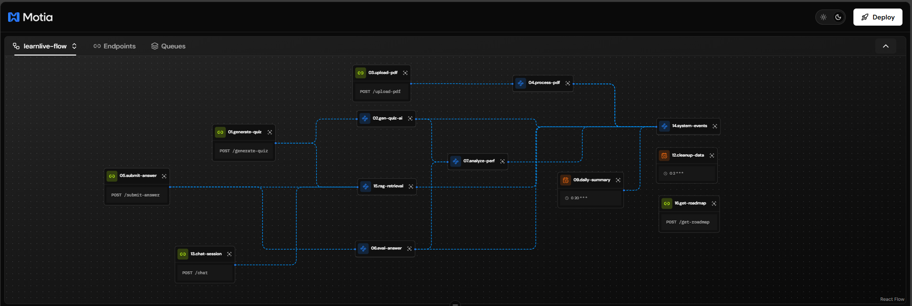

# LearnLive AI - Backend

AI-powered educational platform built with **Motia** for intelligent quiz generation, oral test evaluation, and personalized learning roadmaps.

## 🏗️ Architecture

Built using **Motia** - a serverless workflow orchestration framework featuring:
- Event-driven step functions
- Distributed state management
- Durable orchestration
- Built-in cron scheduling

## 🔄 Workflow Visualization



## 🚀 Features

### 1. **RAG-Powered Quiz Generation**
- Upload PDFs to build knowledge base
- AI generates quizzes from your curriculum materials
- Context-aware questions using RAG (Retrieval-Augmented Generation)

### 2. **Intelligent Oral Test Evaluation**
- Voice-to-text answer transcription
- AI evaluates answers against PDF content
- Provides constructive feedback and scores

### 3. **AI Chat Assistant**
- Ask questions about your study materials
- Gemini-powered conversational responses
- RAG retrieval for accurate, curriculum-specific answers

### 4. **Personalized Learning Analytics**
- Tracks quiz and oral test performance
- Identifies weak and strong topics
- Generates personalized learning roadmaps
- Provides actionable study recommendations

### 5. **Automated Workflows**
- Daily summaries (cron job)
- Data cleanup automation
- Event logging and monitoring

## 📁 Project Structure

```
Backend/
├── src/
│   ├── steps/           # Motia step functions
│   │   ├── 01.generate-quiz.step.ts      # Quiz generation API
│   │   ├── 02_gen_quiz-ai_step.py        # Quiz AI generation
│   │   ├── 03.upload-pdf.step.ts         # PDF upload API
│   │   ├── 04_process_pdf_step.py        # PDF processing & chunking
│   │   ├── 05.submit-answer.step.ts      # Oral test submission API
│   │   ├── 06_eval_answer_step.py        # Answer evaluation AI
│   │   ├── 07.analyze-perf.step.ts       # Performance analytics
│   │   ├── 08.daily-summary.step.ts      # Daily summary cron
│   │   ├── 09.cleanup-data.step.ts       # Data cleanup cron
│   │   ├── 10.chat-session.step.ts       # Chat API
│   │   ├── 11.system-events.step.ts      # Event logging
│   │   ├── 12_rag_retrieval_step.py      # RAG retrieval service
│   │   └── 13.get-roadmap.step.ts        # Roadmap API
│   └── lib/
│       └── db.ts                          # Database abstraction
├── motia.config.ts                        # Motia configuration
├── motia-workbench.json                   # Workbench visualization
└── types.d.ts                             # TypeScript type definitions
```

## 🔄 Data Flow

### Quiz Generation Flow
```
User → 01.generate-quiz → 12.rag-retrieval → 02.gen-quiz-ai → User
                              ↓
                    (Retrieves context from PDFs)
```

### Oral Test Flow
```
User → 05.submit-answer → 12.rag-retrieval → 06.eval-answer → User
                              ↓
                    (Retrieves reference answer)
```

### Analytics Flow
```
Quiz/Oral Test → 07.analyze-perf → Database
                      ↓
            Generates personalized roadmap
                      ↓
            User → 13.get-roadmap → Roadmap
```

### Chat Flow
```
User → 10.chat-session → 12.rag-retrieval → Gemini AI → User
                              ↓
                    (Retrieves curriculum context)
```

## 🛠️ Tech Stack

- **Framework**: Motia (Serverless orchestration)
- **Languages**: TypeScript, Python
- **AI/ML**: 
  - Google Gemini 1.5 Flash
  - Sentence Transformers (all-MiniLM-L6-v2)
  - Cross-Encoder (ms-marco-MiniLM-L-6-v2)
- **Vector DB**: Pinecone (1024-dim embeddings)
- **State Management**: Motia distributed state
- **Database**: In-memory mock (easily swappable with Prisma/PostgreSQL)

## 🚦 Getting Started

### Prerequisites
```bash
Node.js >= 18
Python >= 3.9
```

### Environment Variables
Create a `.env` file:
```env
PINECONE_API_KEY=your_pinecone_api_key
GEMINI_API_KEY=your_gemini_api_key
```

### Installation
```bash
# Install dependencies
npm install
pip install -r requirements.txt

# Download NLTK data (for PDF processing)
python -c "import nltk; nltk.download('punkt')"
```

### Run Development Server
```bash
npm run dev
```

Server runs on `http://localhost:3000`

### View Workbench (Visual Flow Editor)
```bash
npm run workbench
```

Opens at `http://localhost:3001`

## 📡 API Endpoints

### Quiz Generation
```http
POST /generate-quiz
Content-Type: application/json

{
  "studentId": "student-1",
  "topic": "Photosynthesis",
  "numQuestions": 5,
  "difficulty": "medium"
}
```

### Upload PDF
```http
POST /upload-pdf
Content-Type: multipart/form-data

file: biology-textbook.pdf
```

### Submit Oral Test Answer
```http
POST /submit-answer
Content-Type: application/json

{
  "studentId": "student-1",
  "question": "What is photosynthesis?",
  "transcript": "It's how plants make food from sunlight..."
}
```

### Get Learning Roadmap
```http
POST /get-roadmap
Content-Type: application/json

{
  "studentId": "student-1"
}
```

### Chat with AI
```http
POST /chat
Content-Type: application/json

{
  "sessionId": "session-123",
  "message": "Explain DNA replication"
}
```

## 🔧 Configuration

### Motia Config (`motia.config.ts`)
```typescript
export default {
  port: 3000,
  stepsDirectory: './src/steps',
  logLevel: 'info'
}
```

### Cron Jobs
- **Daily Summary**: Every day at 8 PM (`0 20 * * *`)
- **Data Cleanup**: Every night at 2 AM (`0 2 * * *`)

## 📊 Database Schema

### Mock Tables (in-memory)
- **students**: Student information
- **tests**: Quiz and oral test records
- **analytics**: Performance metrics
- **roadmaps**: Personalized learning paths

**Note**: Currently using in-memory storage. For production, swap with Prisma + PostgreSQL.

## 🧪 Testing

```bash
# Test quiz generation
curl -X POST http://localhost:3000/generate-quiz \
  -H "Content-Type: application/json" \
  -d '{"studentId":"student-1","topic":"Physics","numQuestions":3,"difficulty":"easy"}'

# Test chat
curl -X POST http://localhost:3000/chat \
  -H "Content-Type: application/json" \
  -d '{"sessionId":"test-1","message":"What is gravity?"}'
```

## 🎯 Key Features for Judges

1. **RAG Integration**: Real PDF content → Vector DB → Contextual AI responses
2. **Event-Driven**: Fully decoupled microservices using Motia events
3. **Durable Orchestration**: Workflows resume after server restart
4. **Hybrid Storage**: Motia state + Database for best of both worlds
5. **Production-Ready**: Clean architecture, CRUD operations, type-safe

## 🔄 Workflow Visualization

Use the **Motia Workbench** to visualize the entire `learnlive-flow`:
- See all 13 steps connected
- Understand data flow
- Debug event emissions

## 📝 Development Notes

### Adding New Steps
1. Create step file in `src/steps/`
2. Add to `flows: ['learnlive-flow']`
3. Define `subscribes` and `emits`
4. Restart server - auto-discovered!

### Event Communication
```typescript
// Emit event
await ctx.emit('my.event', { data: 'value' });

// Wait for event (durable)
const result = await ctx.waitFor('response.event', {
  filter: (e) => e.requestId === myId,
  timeout: 10000
});
```

### State Management
```typescript
// Save state
await ctx.setState('key:id', { data: 'value' });

// Get state
const data = await ctx.getState('key:id');
```

## 🚀 Deployment

### Build
```bash
npm run build
```

### Production Run
```bash
npm start
```

### Environment
- Ensure all API keys are set
- Configure Pinecone index
- Set up production database

## 📚 Resources

- [Motia Documentation](https://motia.dev)
- [Gemini API](https://ai.google.dev)
- [Pinecone Docs](https://docs.pinecone.io)

## 👥 Team

Built for [Hackathon Name] by [Your Team Name]

## 📄 License

MIT